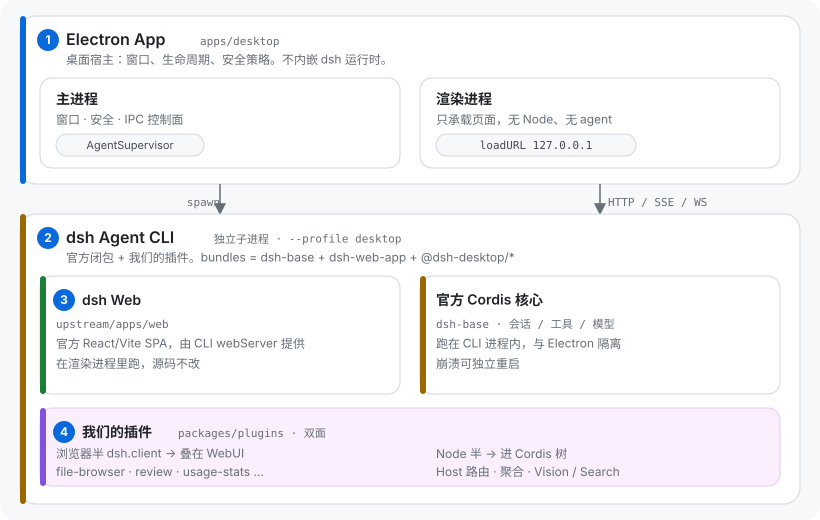

<div align="center">


# DeepSeek Harness Desktop

**把可组合的 agent harness，变成一个真正适合长期工作的桌面工作台。**

[](https://github.com/zeroy1024/dsh-desktop/actions/workflows/ci.yml)
[](https://github.com/zeroy1024/dsh-desktop/releases)


[](https://linux.do/)

[快速开始](#快速开始) · [功能特性](#功能特性) · [与官方 dsh 的关系](#与官方-dsh-的关系) · [架构](#架构) · [补丁清单](#上游补丁清单) · [常见问题](#常见问题) · [文档](#文档)


</div>

## 简介

DeepSeek Harness Desktop 是基于 [DeepSeek Harness](https://github.com/deepseek-ai/deepseek-harness)（`dsh`）的 Electron 桌面宿主与产品插件集合。官方 dsh 的会话、工具和模型协议不变；本项目补齐原生窗口、进程监管、右侧工作面板、文件浏览、改动审查和会话管理。

**Electron 管桌面宿主，dsh 作为独立 agent 子进程运行。** 产品功能优先做插件，上游必要改动通过可审计的最小补丁维护。

> [!IMPORTANT]
> 项目与上游 dsh 均处于 **Developer Preview**。接口、数据格式和插件契约可能发生破坏性变化，适合体验和研究，不建议用于生产。

## 快速开始

### 下载安装包

前往 [GitHub Releases](https://github.com/zeroy1024/dsh-desktop/releases) 下载：

| 平台 | 安装包 |
| --- | --- |
| macOS (Apple Silicon) | `.dmg` / `.zip` |
| Windows (x64) | `.exe`（NSIS）/ `.zip` |
| Linux (x64) | `.AppImage` / `.tar.gz` |

当前不提供 Intel Mac 安装包。安装包内置打过补丁的 dsh CLI 和内置插件，首次启动会解压运行时，无需单独安装 Node.js 或 dsh。

> [!WARNING]
> 安装包**未经签名和公证**：macOS 需在「系统设置 → 隐私与安全性」放行；Windows SmartScreen 可能提示未知发布者；Linux AppImage 依赖 FUSE 或 user namespaces（Chromium sandbox 会自动回退）。

### 首次使用

1. 启动应用，打开**设置**，为模型提供商配置 API key。
2. 若已在用命令行 dsh，桌面版默认读取同一份 `~/.dsh`（key、profiles、sessions 互通），一般不必重配。
3. 需要图片理解或联网搜索时，在设置的插件配置里分别填写 Vision / Web Search 的 endpoint 与 key；未配置时这两项不参与请求。

隔离测试可覆盖主目录：`DSH_HOME=/tmp/dsh-desktop-test`。

### 从源码运行

需要 Node.js 24（[`.nvmrc`](.nvmrc)）、pnpm 11.24.0（[`package.json`](package.json) 固定），并能递归初始化 submodule。

```bash
git clone --recurse-submodules https://github.com/zeroy1024/dsh-desktop.git
cd dsh-desktop

pnpm install --filter . --frozen-lockfile --ignore-scripts
pnpm sync:upstream
pnpm install --frozen-lockfile
pnpm dev
```

`pnpm dev` 会校验 vendor、构建插件和桌面壳并启动 Electron。本地缺 Electron 二进制时会自动安装。开发命令、测试与打包见 [文档索引](docs/README.md) 和 [CI 说明](docs/ci.md)。

## 功能特性

- **原生窗口**：Windows 标题栏 / WCO / Mica 回退；macOS hidden inset 与 vibrancy；Linux hidden titlebar。
- **进程监管**：dsh 独立子进程运行，宿主负责生命周期、日志脱敏轮转、崩溃发现与恢复。
- **工作面板**：轨迹视图、活动分组、只读文件浏览（含 Markdown 文档预览）、模型切换。
- **改动审查（Review）**：聚合会话内 write/edit 与 Git 未提交改动，按文件看 diff，支持标记、行级评论并回灌给 agent。
- **会话管理**：撤回编辑（Rewind）、归档与恢复、按模型聚合的本机 token 用量。
- **能力补全**：Vision 为文本模型桥接图片证据；Web Search 为 `web_search` 补充结构化来源。

> [!NOTE]
> Review 是「**人审 agent 改动**」的 diff 面板，不是 AI 自动代码审查；Git 模式只覆盖未提交改动。

内置插件随应用分发、开箱可用，名册与开发桩见 [`packages/plugins/`](packages/plugins/)。

## 与官方 dsh 的关系

官方入口是 `npx @deepseek-ai/dsh web`（本地 Web UI + 浏览器）。本项目**不替代这个核心**，只加桌面宿主和产品插件：

| | 官方 dsh | Desktop |
| --- | --- | --- |
| 入口 | CLI 启动 Web UI | 安装包 / `pnpm dev` |
| 宿主 | 浏览器 | Electron 原生窗口 |
| Agent | dsh 进程 | 仍是独立子进程，由 `AgentSupervisor` 监管 |
| 插件 | 官方插件机制 | 随 app staging，不写入用户的 `web` profile |
| 数据 | dsh 存储目录 | 默认共享 `~/.dsh` |

这不是完整 fork：`upstream/` 是锁版 submodule，接缝才进 [`patches/`](patches/patches.yml)。这也不是另一个 agent：会话、工具、模型和 Web 协议仍是 dsh 的。

## 架构

<div align="center">

</div>

四层从上到下、从宿主到核心：

1. **Electron App**（`apps/desktop`）：主进程管窗口与 `AgentSupervisor`，渲染进程只承载页面。
2. **dsh Agent CLI**：独立子进程 `dsh --profile desktop --no-open --port 0`，崩溃与 Electron 隔离。
3. **dsh Web**（`upstream/apps/web`）：官方 SPA，由 CLI 的 webServer 提供给渲染进程；源码不改。
4. **我们的插件**（`packages/plugins`）：双面——浏览器半（`dsh.client`）叠在 WebUI 上，Node 半进 Cordis 树。随 app stage，不写入用户的 `web` profile。

主进程 spawn CLI 并解析 ready 端口；渲染进程经 `http://127.0.0.1:<port>/` 使用同一 loopback 的 HTTP/SSE/WS。细节见 [`docs/architecture.md`](docs/architecture.md)。

> [!CAUTION]
> 当前不是 IPC 级隔离：数据面仍是 loopback HTTP；为兼容上游动态模块加载，CSP 仍含 `unsafe-eval` / `unsafe-inline`。

## 上游补丁清单

当前维护 **18 个补丁**，基线为 `dsh-v0.1.2-rc.1`。按独立逻辑变更及撤销条件划分文件，按功能和消费者分类；功能相关的补丁不强行合并。0017 仅保留搜索投影，配置 provider 替换及其测试独立为 0021。此次整理不改变整条队列最终生成的上游代码。

下表按稳定编号展示；**实际应用顺序以 [patches.yml](patches/patches.yml) 为准，不能按编号排序**。消费者列的插件均位于 `packages/plugins/`。目前全部 `upstreamStatus` 为 `unverified`，表示尚无已核实的上游提交记录，不等于确认“未提交”。每项的具体撤销条件见登记中的 `removeWhen`。

| 补丁 | 功能分类 | 改动性质 | 消费者 | 主要改动 | 作用 |
| --- | --- | --- | --- | --- | --- |
| [0001](patches/0001-ui-workspace-row-actions.patch) | 会话管理 | 扩展 + 产品选择 | session-actions | 新增行级 menu/inline 动作注册表和渲染点；会话、工作区菜单以指针位置右键打开，移除原生省略号入口。 | 支持插件导出链接、快捷归档等操作，复用原生 rename/fork/archive 回调。 |
| [0005](patches/0005-conversation-chat-group-seam.patch) | 聊天流 | 通用扩展 | activity-group | 新增 chat group 槽、flowGrouping、reasoning/prose 渲染变体；复用原生 Seat 可见性。 | 插件可以折叠过程节点，同时保留回合折叠、搜索隐藏及最终回答的正确显示。 |
| [0006](patches/0006-ui-layout-panel-seam.patch) | 面板 | 扩展 + 产品选择 | panel-shell、file-browser、review | 新增 panel 列、宽度 store 和动作、拖动与全屏布局；调整侧栏及主栏尺寸，优化静态槽渲染。 | 为多页签工作面板提供容器，支持缩放和全屏并保留关闭时的页面状态。 |
| [0007](patches/0007-ui-trajectory-view-factory.patch) | 面板 | 通用扩展 | panel-shell | 公开 trajectoryView.create 和幂等 setDefaultEnabled，保留原生注入与图片子槽。 | 在面板中复用原生轨迹视图；插件接管、卸载时正确关闭或恢复默认轨迹入口。 |
| [0008](patches/0008-ui-chat-panel-inspect-handoff.patch) | 面板 | 扩展 + 产品接线 | panel-shell | 增加 inspectHandoff；探测 panelShell.inspect，交接 trajectory 目标，未处理时回退原生 openView。 | 聊天中的 Inspect 可跳转到面板里的对应工具调用。 |
| [0009](patches/0009-ui-chat-file-browser-open-seam.patch) | 文件浏览 | 扩展 + 产品接线 | file-browser | 在 openFile 中询问 fileBrowser.tryOpen，传入 sessionId、cwd 和解析后的路径。 | 让插件预览文件；当前目录、服务缺席或未处理路径继续系统打开。 |
| [0010](patches/0010-api-session-controller-image-admission.patch) | 图片桥接 | 通用扩展 | vision | 附件持久化前抽取图片准入判断，询问可选 imageInputAdmission，并保留真实模型能力信息。 | 允许桥接服务接纳文本模型的图片输入，同时保留 native/unknown 与原生错误语义。 |
| [0011](patches/0011-llm-input-transform-seam.patch) | 图片桥接 | 通用扩展 | vision | 增加 registerInputTransform，传入精确模型能力、实际工具名与取消信号；支持顺序执行及卸载。 | 模型调用前把图片转换成文本证据，不修改持久会话；原生图片和无图请求直接跳过。 |
| [0012](patches/0012-core-session-rewind-tombstone.patch) | 撤回 | 行为扩展 | rewind | 登记 required 撤回墓碑并实现 surface 截断；同步 TokenMeter、校准及版本化投影，引入惰性历史前缀。 | 撤回后模型上下文、压缩和计量一致；保留原始日志及累计计费，旧 CLI 对未知 required 事件拒读。 |
| [0013](patches/0013-session-controller-event-views.patch) | 撤回 | 通用扩展 | rewind | 增加 sessionEventViews 注册表、稳定事件源代理及 historyStartSeq 原始分页游标。 | 插件可过滤既有与未来会话的可见事件，支持卸载恢复；隐藏整页仍能继续分页。 |
| [0014](patches/0014-settings-section-icon-slot.patch) | 设置 | 通用扩展 | archive-manager、usage-stats | 新增按 section id 匹配的 settings.section.icon 槽，保留原生图标 fallback。 | 任意设置插件可贡献导航图标，不在上游硬编码插件 id。 |
| [0015](patches/0015-win32-dialog-sandbox-safe-utf16-read.patch) | 原生运行时 | 兼容修复 | Electron 桌面宿主 | 将 Win32 COM 字符串读取从 koffi.view 改为复制式 koffi.decode.string16。 | 避免 Electron V8 Sandbox 的 external ArrayBuffer 崩溃，保留原生目录选择器行为。 |
| [0016](patches/0016-workspace-unarchive-api.patch) | 会话管理 | 通用扩展 | archive-manager | 公开幂等 unarchiveSession，复用串行写入队列，卸载前排空已接纳操作。 | 安全恢复归档会话并持久化，保留工作区位置及失败时的内存一致性。 |
| [0017](patches/0017-session-query-document-projection.patch) | 撤回 / 搜索 | 通用扩展 | rewind | 公开 buildSearchDocuments 和 searchDocumentVersion；全文索引与 literal filter 共用投影，版本变化重建索引。 | 撤回内容不再出现在语义搜索中；精确事件读取仍保留原始日志。 |
| [0018](patches/0018-conversation-draft-image-api.patch) | 撤回 / 草稿 | 通用扩展 | rewind | 在 IConversation 公开 createDraftImages/releaseDraftImages，批量注册失败时回滚临时 URL。 | 历史图片可经插件恢复到输入草稿，并正确处理准备失败和取消后的资源释放。 |
| [0019](patches/0019-sandbox-escalation-idempotent.patch) | 沙箱 | 行为修正 | dsh bash / pwsh / fs 工具 | 已知且等宽或更窄的升权目标按当前生效模式执行；未知模式继续拒绝，更宽目标仍走审批。 | 避免权限本已满足的工具调用误报失败，统一各工具家族的幂等行为。 |
| [0020](patches/0020-llm-pi-ai-model-policy.patch) | 模型策略 | 通用扩展 | model-selection-direct | 增加逐模型 api/baseURL/thinking、显式 api-root 及请求编码规则，保留原生认证和未覆盖模型 dispatch。 | 支持混合协议模型与准确的思考选项；拒绝不兼容的等级和二元 thinking 编码组合。 |
| [0021](patches/0021-include-provider-replacement.patch) | 配置装配 | 通用扩展 + 隔离修复 | rewind | 新增 Include replaceName，保留 name 校验和原 id/配置；克隆插入与覆写值，组合回归测试随补丁维护。 | 可替换 provider 而不复制配置或破坏后续用户层，重复合成不会污染输入；从原 0017 独立拆出。 |

### 维护约定

- `category` 区分 `extension`（通用扩展）、`compatibility`（运行时兼容）、`behavior`（行为语义）和 `product-extension`（包含产品选择或接线的扩展）；`feature` 和 `consumers` 记录功能与消费方。
- `reason` 解释插件或配置无法解决的边界；`removeWhen` 给出可验证的撤销条件。`upstreamStatus` 使用 `unverified`、`pending`、`submitted`、`accepted`、`local-only`；已提交或已接受必须附 `upstream` 引用。状态确认后再更新，不推断上游是否已接收。
- `dependencies` 的每项包含 `file`、`kind` 和 `reason`。`semantic` 表示 API/行为前置，`context` 表示 diff 上下文前置；解析器拒绝缺失、重复、自依赖、逆序及循环依赖。当前 0005 对 0008 是上下文依赖，不是分组功能需要 Inspect；0017 与 0021 则是 rewind 的组合消费，互不声明补丁依赖。
- 新登记项应填写完整维护信息。解析器兼容旧队列仅有 `file/reason` 的格式，以便 `--replace-patches-from` 迁移。编号保持稳定；0001、0007、0013、0014 的文件名已改为当前能力名称，不改变编号与原有相对顺序。
- 实现、关联修正和契约测试在同一补丁内维护。跨层功能由插件集成测试验证；完整队列通过同步构建、vendor 分发与桌面运行时检查。补丁拆分或重排必须核对最终 Git tree 与旧队列一致（纯整理时），并演练正序套用和逆序撤销。

修改已套用的队列前，先将完整 `patches/` 备份到仓库外，再执行 `pnpm sync:upstream -- --replace-patches-from <旧patches目录>`。验证命令为 `pnpm test:scripts`、`pnpm rehearse:queue`、`pnpm test:upstream-patches`，以及相关类型和 lint 检查。同步机制详见 [架构说明](docs/architecture.md)。

## 常见问题

### 这是官方 dsh 的 fork 吗？

不是完整 fork。submodule 固定上游版本，功能走插件和配置，必要接缝才用补丁队列，以便跟随官方升级。

### 会破坏我的命令行 dsh 配置吗？

不会。默认共享 `~/.dsh`，内置插件只装配在 `desktop` profile，不写入命令行的 `web` profile。完全隔离时设置独立 `DSH_HOME`。

### Review 会自动帮我找 bug 吗？

不会。它帮**人**检查 agent 改动。AI reviewer 与 PR bot 属于后续方向。

### 可以把插件单独装到官方 dsh 吗？

当前是随桌面应用分发的内部部件，不做独立安装承诺。源码可作为扩展参考。

## 文档

- [文档索引](docs/README.md)
- [架构总览](docs/architecture.md) · [窗口与标题栏](docs/overlay-titlebar.md) · [CI](docs/ci.md)

## 致谢

- [DeepSeek Harness（dsh）](https://github.com/deepseek-ai/deepseek-harness) — agent harness 核心
- [Cordis](https://github.com/cordisjs/cordis) — dsh 的插件化运行时
- [JetBrains intellij-community](https://github.com/JetBrains/intellij-community) — 文件浏览器图标来源（Apache-2.0；完整文本见 [THIRD_PARTY_NOTICES](packages/plugins/file-browser/THIRD_PARTY_NOTICES)）。JetBrains 名称与商标不随图标许可授予。

本项目以 [MIT](LICENSE) 开源。感谢 [LINUX DO](https://linux.do/) 社区。喜欢的话欢迎点一个 Star。
