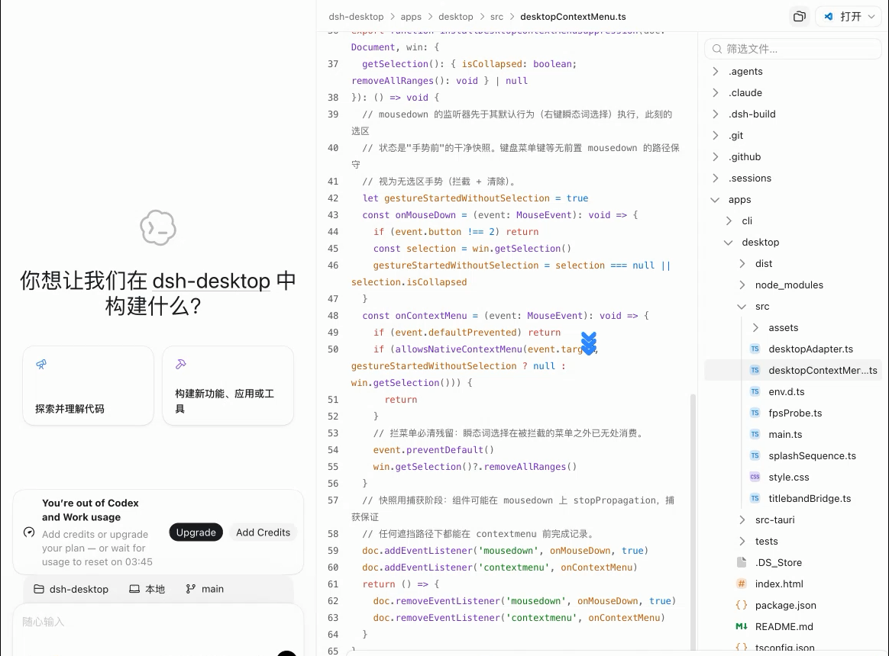

<div align="center">


# DeepSeek Harness Desktop

**把可组合的 agent harness，变成一个真正适合长期工作的桌面工作台。**

[](https://github.com/zeroy1024/dsh-desktop/actions/workflows/ci.yml)
[](https://github.com/zeroy1024/dsh-desktop/releases)


如果这个项目对你有帮助，欢迎点一个 Star，这对独立项目很重要。

[快速开始](#快速开始) · [功能特性](#功能特性) · [与官方 dsh 的关系](#与官方-dsh-的关系) · [架构](#架构) · [文档](#文档) · [常见问题](#常见问题)



</div>

## 简介

DeepSeek Harness Desktop 是基于 [DeepSeek Harness](https://github.com/deepseek-ai/deepseek-harness)（`dsh`）构建的 Electron 桌面宿主与产品化插件集合。它保留官方 dsh 的 Cordis 插件化 agent 核心，同时补齐桌面窗口、进程监管、右侧工作面板、文件浏览、改动审查和会话管理等能力。

它不是把上游 WebUI 复制一份，也不是把 dsh 运行时塞进 Electron 主进程：**Electron 负责桌面宿主，dsh 作为独立 agent 子进程运行，产品功能优先通过插件实现，上游必要改动通过可审计的最小补丁维护。**

> [!IMPORTANT]
> 项目与上游 dsh 均处于 **Developer Preview** 阶段，接口、数据格式和插件契约可能发生破坏性变化。当前版本适合体验、研究和二次开发，不建议用于生产环境。

## 功能特性

### 桌面化 agent 工作台

- **原生窗口体验**：Windows 标题栏、Window Controls Overlay、Mica 回退；macOS hidden inset 与 vibrancy；Linux hidden titlebar。
- **进程监管**：dsh agent 独立子进程运行，桌面宿主负责生命周期、日志脱敏轮转、崩溃发现与恢复。
- **轨迹视图**：agent 执行轨迹从主对话流迁移到独立面板页，保持对话流清爽。

### 面向长任务的工作面板

- **活动分组**：连续思考步骤和工具调用折叠成摘要，展开仍可查看完整过程。
- **文件浏览器**：只读查看当前会话工作区的目录、源码和 Markdown。
- **改动审查（Review）**：聚合会话内 write/edit 改动与 Git 未提交改动，按文件查看 diff，支持标记、行级评论并回灌给 agent。
- **模型选择器**：在会话中直接切换 provider、model 和 reasoning effort。

### 会话管理与能力补全

- **撤回编辑（Rewind）**：在原会话中撤回某条用户消息之前的上下文，原文与图片放回输入框。
- **归档管理**：查看、排序、按工作区分组并恢复归档会话。
- **Vision**：为不支持图片输入的文本模型提供可配置的图片证据桥接。
- **Web Search**：通过辅助模型和原生搜索工具，为 dsh 的 `web_search` 补充结构化来源。

> [!NOTE]
> Review 是"**人审 agent 改动**"的 diff 面板，不是 AI 自动代码审查；Git 模式当前只覆盖未提交改动。AI reviewer 与 PR bot 属于后续方向。

## 快速开始

### 方式一：下载安装包

前往 [GitHub Releases](https://github.com/zeroy1024/dsh-desktop/releases) 下载对应平台的安装包：

| 平台 | 安装包 |
| --- | --- |
| macOS (Apple Silicon) | `.dmg` / `.zip` |
| Windows (x64) | `.exe`（NSIS 安装器）/ `.zip` |
| Linux (x64) | `.AppImage` / `.tar.gz` |

安装包内置打过补丁的 dsh CLI 和全部内置插件，首次启动时自动解压运行时，无需单独安装 Node.js 或 dsh。

> [!WARNING]
> 当前安装包**未经签名和公证**：macOS 首次打开需在"系统设置 → 隐私与安全性"中放行，Windows SmartScreen 可能提示未知发布者，Linux AppImage 依赖 FUSE 或 user namespaces（Chromium sandbox 会自动回退）。

### 方式二：从源码运行

环境要求：Node.js 24（见 [`.nvmrc`](.nvmrc)）、pnpm 11.24.0（由 [`package.json`](package.json) 固定）、能递归初始化 Git submodule。

```bash
git clone --recurse-submodules https://github.com/zeroy1024/dsh-desktop.git
cd dsh-desktop

# 首次生成打过补丁的 dsh vendor 闭包
pnpm install --filter . --frozen-lockfile --ignore-scripts
pnpm sync:upstream
pnpm install --frozen-lockfile

# 构建插件并启动 Electron
pnpm dev
```

`pnpm dev` 会依次检查 vendor 产物、构建内置插件、构建桌面壳并启动 Electron；本地缺少 Electron 二进制时会自动安装（手动执行 `pnpm --filter @dsh-desktop/desktop exec install-electron`）。

> [!TIP]
> 桌面版默认与命令行 dsh 共享 `~/.dsh`（API key、profiles、sessions 互通）。需要隔离测试时覆盖 `DSH_HOME`：`DSH_HOME=/tmp/dsh-desktop-test pnpm dev`。

常用命令：

| 命令 | 用途 |
| --- | --- |
| `pnpm dev` | 构建插件和桌面壳并启动 Electron |
| `pnpm build` | 构建所有 workspace 并执行插件 staging |
| `pnpm test` / `pnpm lint` / `pnpm typecheck` | 单元测试 / oxlint / TypeScript 检查 |
| `pnpm sync:upstream` | 套补丁 → 构建上游 → pack → 重建 `vendor/dsh-cli` |
| `pnpm ci:smoke` | native 探针 + dsh Web runtime + Electron 启动 smoke |
| `pnpm --filter @dsh-desktop/desktop package:mac` | macOS arm64：DMG + ZIP（`package:win` / `package:linux` 同理） |

## 与官方 dsh 的关系

官方 [DeepSeek Harness](https://github.com/deepseek-ai/deepseek-harness) 是可组合的 agent harness，主要入口是 `npx @deepseek-ai/dsh web`——在本地启动 Web UI 后交给浏览器访问。**本项目不替代这个核心**，而是在它之上增加桌面宿主和应用级插件分发层：

| 维度 | 官方 dsh | DeepSeek Harness Desktop |
| --- | --- | --- |
| 产品定位 | 可组合的 agent harness | Electron 桌面宿主 + dsh agent + 内置产品插件 |
| 主要入口 | CLI 启动本地 Web UI | 安装包 / `pnpm dev` |
| UI 宿主 | 浏览器 | Electron 原生窗口 |
| agent 进程 | dsh CLI/Web 服务 | 仍是独立子进程，由 `AgentSupervisor` 监管 |
| 插件安装 | 官方插件机制 | 插件随 app 构建、staging 和分发，开箱可用 |
| 桌面体验 | 由浏览器提供窗口 | titleband、侧栏、右侧 panel、WCO、Mica/vibrancy |
| 运行时分发 | npm / 源码 | electron-builder 携带 `dsh-cli.tar`，首启解压 |
| 上游定制 | 官方源码与插件仓库 | 优先插件，其次配置叠层，最后才是登记过的最小 patch |
| 用户数据 | dsh 存储目录 | 默认共享 `~/.dsh`，只隔离 app 托管的 `desktop` profile |

两点特别说明：

1. **这不是完整 fork。** `upstream/` 是锁定版本的 Git submodule；无法通过插件或配置层实现的改动才进入 `patches/*.patch`，并在 [`patches/patches.yml`](patches/patches.yml) 登记理由。
2. **这也不是另一个 agent。** 桌面版仍使用 dsh 的会话、工具、模型和 Web 协议；本项目负责的是宿主、分发、UI 扩展和必要的接缝维护。

## 内置插件

以下 12 个内置插件由应用管理（详见 [`packages/plugins/`](packages/plugins/)）：

| 插件 | 作用 |
| --- | --- |
| `desktop-frame` | 桌面 titleband、平台窗口适配、侧栏和菜单体验 |
| `panel-shell` | 右侧多页签面板容器和页面注册协议 |
| `activity-group` | 折叠连续思考步骤和工具调用 |
| `model-selection-direct` | 直接选择 provider、model 和 reasoning effort |
| `file-browser` | 工作区只读文件树、源码和 Markdown 预览 |
| `review` | 会话/Git 改动 diff、人审标记、行级评论和单文件撤销 |
| `archive-manager` | 查看、排序、分组和恢复归档会话 |
| `session-actions` | 会话行快速归档与含后代的 ZIP 日志导出 |
| `rewind` | 撤回用户消息之前的会话上下文并回填原文与图片 |
| `vision` | 为文本模型桥接图片理解能力 |
| `web-search` | 为现有 `web_search` 工具提供结构化搜索来源 |
| `fps-overlay` | 开发态 FPS HUD（仅 unpackaged 开发模式显示） |

> [!NOTE]
> Vision 需单独配置视觉 API，Web Search 需配置辅助 endpoint/key；`hello-panel` 默认禁用，`panel-page-stub` 仅在开发模式装配。

## 架构

```text
┌─────────────────────────────────────────────────────────────┐
│ Electron 桌面层（apps/desktop）                              │
│ 窗口、生命周期、安全策略、AgentSupervisor、IPC 控制面         │
├─────────────────────────────────────────────────────────────┤
│ dsh WebUI 层（upstream/apps/web + 我们的 client plugins）    │
│ React/Vite SPA；UI 定制优先通过 dsh.client 插件              │
├─────────────────────────────────────────────────────────────┤
│ dsh Agent 层（独立 dsh CLI 子进程 + Cordis 插件树）          │
│ profile 组合、服务、工具和会话运行时                          │
└─────────────────────────────────────────────────────────────┘
```

当前采用"**独立子进程 + loopback HTTP**"方案：Electron 主进程 spawn `dsh --profile desktop --no-open --port 0`，`AgentSupervisor` 解析 ready 行并监管重启，渲染进程加载 `http://127.0.0.1:<port>/` 并通过同一 loopback origin 访问 dsh 的 HTTP/SSE/WS 能力。agent 与主进程相互隔离、可独立崩溃重启；agent 日志写入 `userData/logs/dsh-agent.log`。

内置插件在构建后 stage 到应用携带的 dsh CLI 闭包中，启动前物化为 app 托管的 `desktop` profile——不通过 `dsh plugin add` 写入用户的命令行 profile。平台窗口适配、数据流与插件分发的完整细节见 [`docs/architecture.md`](docs/architecture.md)。

### 安全基线

- renderer 启用 `contextIsolation` 与 `sandbox`，禁用 `nodeIntegration`；
- 导航只放行当前 agent 的精确 scheme/host/port，IPC 只接受主 frame 的当前 agent origin；
- 非应用内外链交给系统浏览器，权限默认拒绝、按白名单开放，主文档附加 CSP；
- 文档 URL 不携带 token，日志敏感字段脱敏；文件浏览与 Git 路由有工作区路径约束、同源校验和超时。

> [!CAUTION]
> 以上不是"完全隔离"的承诺：为兼容上游 WebUI 的动态模块加载，CSP 仍保留 `unsafe-eval`/`unsafe-inline`，数据面仍是 loopback HTTP 而非 IPC 级隔离。

## 当前限制与路线图

以下内容**不是**已完成的产品能力：

- fetch-over-IPC / `file://` 传输：等待上游 webserver 提供正式实现；
- 独立捆绑的 Node runtime（当前打包态用 Electron 的 `ELECTRON_RUN_AS_NODE` 启动 dsh）；
- 安装包签名、公证和自动更新；
- AI 自动代码审查、GitHub PR bot、Review 的 base branch / 指定 commit / PR 评论；
- 归档会话删除（上游暂未提供所需能力）；
- Rewind 仅支持 live 且 agent 空闲的会话，不跨压缩替换边界；未打补丁的官方 CLI 会拒读含撤回墓碑的会话（见 [Rewind 说明](packages/plugins/rewind/README.md)）；
- Vision 的视频理解；Web Search 的内置免费搜索。

下一阶段重点：跟随上游正式扩展点减少本地 patch → 完善 Review 体验 → 评估独立 Node runtime → 完成签名公证与正式发行 → 上游支持后评估真 IPC。

## 常见问题

### 这是官方 dsh 的 fork 吗？

不是完整 fork。项目通过 submodule 固定上游版本，用插件和配置扩展功能，必要的上游接缝才通过补丁队列维护，保留跟随官方升级的路径。

### 桌面版会破坏我的命令行 dsh 配置吗？

不会。桌面版与命令行共享 `~/.dsh` 用户数据，但内置插件装配在 app 托管的 `desktop` profile，不写入命令行使用的 `web` profile。需要完全隔离时设置独立的 `DSH_HOME`。

### Review 会自动帮我找 bug 吗？

不会。Review 是帮助**人**检查 agent 改动的 diff 面板，支持标记、评论和回灌；AI reviewer 与 PR bot 属于未来方向。

### 可以把插件单独安装到官方 dsh 吗？

当前插件是随桌面应用分发的内部产品部件，不做独立安装的兼容承诺；插件源码可作为 dsh 扩展开发的参考。

## 文档

- [文档索引](docs/README.md)：开发说明、插件用法、全部 ADR 与历史记录的统一入口
- [架构总览](docs/architecture.md) / [窗口与标题栏](docs/overlay-titlebar.md)
- [CI 与可复现构建](docs/ci.md)
- [Review 插件说明](packages/plugins/review/README.md) / [Rewind 插件说明](packages/plugins/rewind/README.md)

## 许可证

本项目以 [MIT](LICENSE) 许可证开源。

文件浏览器内置的图标来自 [JetBrains intellij-community](https://github.com/JetBrains/intellij-community)（Apache-2.0，pin 到固定 commit 原样引用；完整许可文本见 [THIRD_PARTY_NOTICES](packages/plugins/file-browser/THIRD_PARTY_NOTICES)）。JetBrains 名称与产品商标不随图标许可授予。

## 致谢

- [DeepSeek Harness（dsh）](https://github.com/deepseek-ai/deepseek-harness) —— 本项目所封装的 agent harness 核心
- [Cordis](https://github.com/cordisjs/cordis) —— dsh 背后的插件化运行时
- [JetBrains intellij-community](https://github.com/JetBrains/intellij-community) —— 文件浏览器内置图标来源
